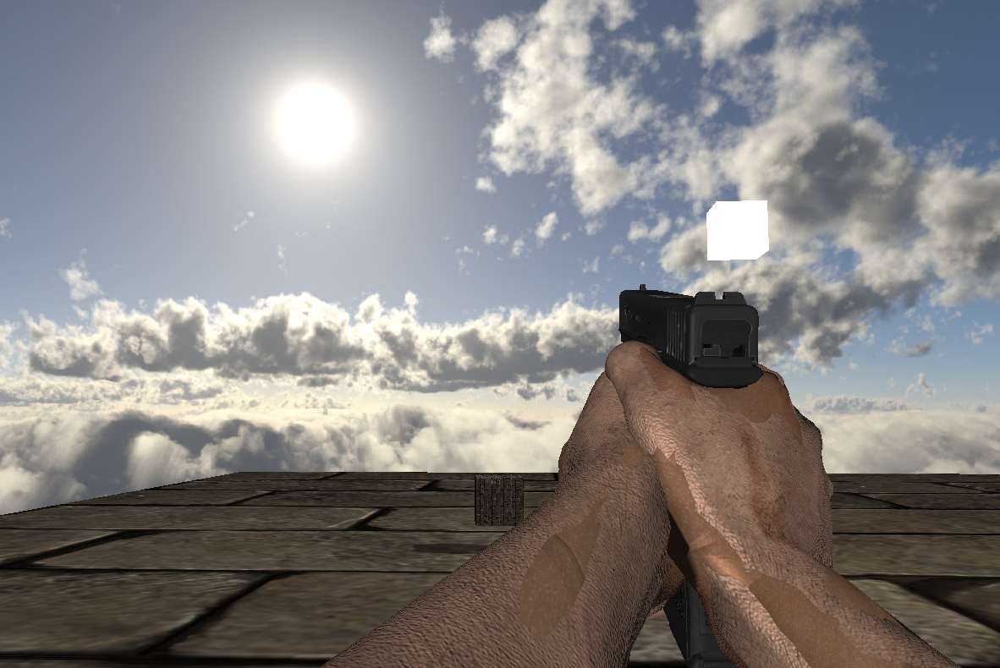

# Nine Thousand Engine

Nine Thousand Engine is a custom-built game engine designed for first-person shooter (FPS) games, developed in C++ and OpenGL. It provides a foundation for rendering, physics, and game logic, allowing for the creation of fast-paced and immersive FPS experiences.
This project is inspired by <a href="https://github.com/livinamuk/Hell2025">livinamusk's Hell Engine</a> codebase and gun assets.

</>