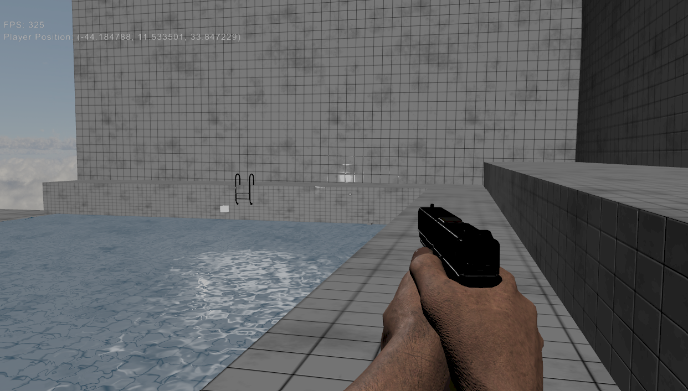

# Nine Thousand Engine

Nine Thousand is a first-person shooter built on a custom engine developed in C++ and OpenGL.

This project is inspired by <a href="https://github.com/livinamuk/Hell2025">livinamusk's Hell Engine</a> codebase and gun assets.

</>