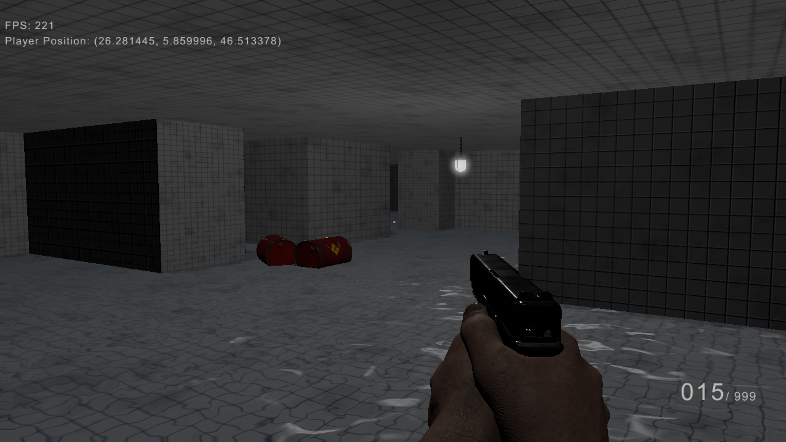

# Nine Thousand Engine

Nine Thousand is a first-person shooter built on a custom engine developed in C++ and OpenGL.
This project is inspired by <a href="https://github.com/livinamuk/Hell2025">livinamusk's Hell Engine</a> codebase and gun assets.

<p align="center"></>

<p align="center"></>

<p align="center"></>

### Download

1. Clone the repo
```sh
   git clone https://github.com/DracoR22/NineThousand.git
```

2. Open the project with Visual Studio or open it as a CMake project.

Note: 
This project is currently in early development. Some features are still being refined, and the gameplay may evolve significantly as development progresses.

### Implemented features
- Full Physically Based Rendering
- AABB Frustum Culling
- Forward and Deferred renderers
- Skeletal Animation
- Bloom
- Cascaded shadow maps
- 3D Level editor
- Custom mesh materials
- Audio manager with FMod
- Water rendering
- Physics with Nvidia's Physx
- Skybox
- Custom font text rendering

### Controls
- Movement: `WASD`
- Jump: `Space Bar`
- Sprint: `Left Shift`
- Switch weapon: `1`
- Attack: `Left Click`
- Open editor: `F1`
- Save current scene: `F2 while in Editor Mode`
- See collisions: `F3`
- Editor rotate view: `Press and hold the middle mouse button to orbit around the scene`